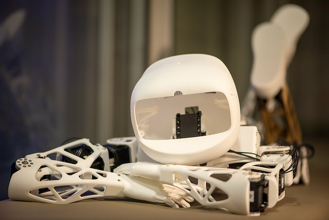

# Poppyrate
*Python notebooks an custom libs created when playing with [@carrnum's Poppy Robot](http://carrefour-numerique.cite-sciences.fr/fablab/wiki/doku.php?id=projets:poppy:poppyrate)* 

[Preview Notebooks](http://nbviewer.ipython.org/github/bumblebeefr/poppy_rate/tree/master/)

--
## To use the notebooks and/or develop on the project :  
* clone/download this project
* execute the `install.sh` script to create a python virtualenv with all needed libraries

You then can use several scripts to help you use the virtual environement:
* `ipython.sh` will launch ipython using the virtuelenv
* `python.sh` will launch python using the virtualenv
* `notebook.sh` will launch ipython notebook using the virualenv
* `update.sh` will update(forced) all depencies defined in requirement.txt

##To install it as a python lib:

    pip install -e git+https://github.com/bumblebeefr/poppy_rate.git#egg=poppy_rate

If you want to install last version of pypot and poppy_humanoid from github with pip (uncomment to install libs in ~/dev/):

    pip install -e git+https://github.com/poppy-project/pypot.git#egg=pypot #--src=/home/$USER/dev/
    pip install -e svn+https://github.com/poppy-project/poppy-humanoid/trunk/software#egg=poppy_humanoid #--src=/home/$USER/dev/
